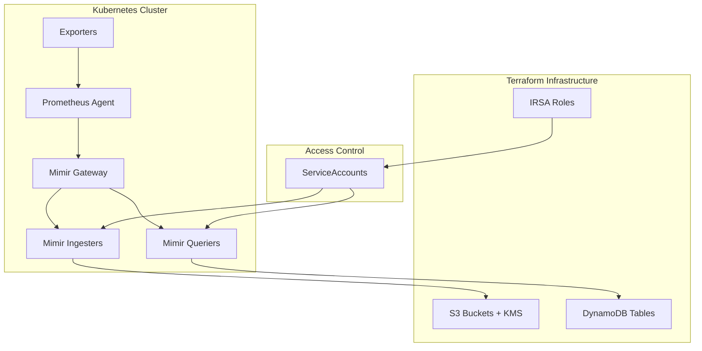

# Infrastructure & Helm Integration Guide

## 🔗 **Terraform ↔ Helm Integration Overview**

This document explains how the Terraform infrastructure connects with Helm deployments for a complete observability stack.

## 📋 **Current Integration Status**

### ✅ **Connected Components**

| Component            | Terraform Module   | Helm Chart                | Integration Status          |
| -------------------- | ------------------ | ------------------------- | --------------------------- |
| **S3 Storage**       | `modules/s3-kms`   | Mimir values              | ✅ Bucket names, KMS keys   |
| **DynamoDB**         | `modules/dynamodb` | Mimir indexing            | ✅ Table names, ARNs        |
| **IAM/IRSA**         | `modules/iam`      | ServiceAccount            | ✅ Role ARNs for AWS access |
| **Exporters**        | N/A                | prometheus-community      | ✅ No AWS deps needed       |
| **Prometheus Agent** | N/A                | prometheus                | ✅ Remote write to Mimir    |
| **Mimir**            | All modules        | grafana/mimir-distributed | ✅ Full AWS integration     |

### 🔄 **Data Flow**



## 🏗️ **Infrastructure Components**

### **1. S3 + KMS Module** (`terraform/modules/s3-kms`)

**Purpose**: Long-term metrics storage with encryption

**Creates**:

- `${project}-${env}-mimir-metrics` bucket
- KMS key for S3 encryption
- Lifecycle policies for cost optimization

**Outputs**:

```hcl
mimir_bucket_name    = "observability-dev-mimir-metrics"
mimir_bucket_arn     = "arn:aws:s3:::observability-dev-mimir-metrics"
kms_key_id          = "arn:aws:kms:us-west-2:123456789:key/..."
```

### **2. DynamoDB Module** (`terraform/modules/dynamodb`)

**Purpose**: Metadata indexing for fast queries

**Creates**:

- Mimir index table with optimized schema
- Pay-per-request billing for variable workloads
- Encryption at rest

**Outputs**:

```hcl
mimir_table_name = "observability-dev-mimir-index"
mimir_table_arn  = "arn:aws:dynamodb:us-west-2:123456789:table/..."
```

### **3. IAM Module** (`terraform/modules/iam`)

**Purpose**: Secure AWS access without stored credentials

**Creates**:

- IRSA roles for EKS service accounts
- Least-privilege policies for S3/DynamoDB access
- Trust relationships with EKS OIDC provider

**Outputs**:

```hcl
mimir_role_arn = "arn:aws:iam::123456789:role/observability-dev-mimir"
```

## 🎯 **Helm Integration Points**

### **1. Mimir Configuration** (`k8s/base/mimir/`)

**Template System**:

- `values.template.yaml` - Template with placeholders
- `values.generated.yaml` - Populated by deployment script
- `values.yaml` - Static base configuration

**Key Integrations**:

```yaml
# S3 Backend (from terraform)
s3:
  bucket_name: "${mimir_s3_bucket_name}" # terraform output
  sse:
    kms_key_id: "${kms_key_id}" # terraform output

# IRSA Integration (from terraform)
serviceAccount:
  annotations:
    eks.amazonaws.com/role-arn: "${mimir_irsa_role_arn}"
```

### **2. Prometheus Agent** (`k8s/base/prometheus-agent/`)

**Remote Write Configuration**:

```yaml
remoteWrite:
  - url: "http://mimir-gateway.observability.svc.cluster.local:8080/api/v1/push"
    name: "mimir"
```

## 🚀 **Deployment Process**

### **Method 1: Automated Script** (Recommended)

```bash
# Complete deployment with integration
./deploy.sh

# Only template values (for testing)
./deploy.sh template

# Validate existing deployment
./deploy.sh validate
```

### **Method 2: Manual Steps**

```bash
# 1. Deploy Terraform infrastructure
cd terraform/envs/dev
terraform init && terraform apply

# 2. Get outputs and template values
terraform output -json > /tmp/tf_outputs.json

# 3. Template Mimir values
envsubst < k8s/base/mimir/values.template.yaml > k8s/base/mimir/values.generated.yaml

# 4. Deploy with Helmfile
helmfile sync
```

### **Method 3: GitOps** (Production)

```bash
# Use ArgoCD Application pointing to this repo
# Values are templated via ArgoCD ConfigManagement plugin
```

## 🔍 **Verification Steps**

### **1. Infrastructure Verification**

```bash
# Check Terraform resources
cd terraform/envs/dev
terraform plan  # Should show no changes

# Verify S3 bucket
aws s3 ls s3://observability-dev-mimir-metrics/

# Verify DynamoDB table
aws dynamodb describe-table --table-name observability-dev-mimir-index
```

### **2. Helm Deployment Verification**

```bash
# Check all components are running
kubectl get pods -n observability

# Verify Mimir gateway
kubectl port-forward -n observability svc/mimir-gateway 8080:8080
curl http://localhost:8080/ready

# Check Prometheus Agent is scraping
kubectl logs -n observability -l app.kubernetes.io/name=prometheus -c prometheus
```

### **3. End-to-End Data Flow**

```bash
# Test metrics ingestion
kubectl exec -n observability deploy/prometheus-agent -- \
  curl -X POST http://mimir-gateway:8080/api/v1/push \
  -H 'Content-Type: application/x-protobuf'

# Query metrics from Mimir
curl "http://localhost:8080/prometheus/api/v1/query?query=up"
```

## ⚠️ **Common Issues & Solutions**

### **1. IRSA Permission Denied**

```bash
# Problem: Mimir pods can't access S3/DynamoDB
# Solution: Check IRSA role trust relationship

kubectl describe sa mimir -n observability
aws iam get-role --role-name observability-dev-mimir
```

### **2. Values Not Templated**

```bash
# Problem: Helm values still have ${placeholders}
# Solution: Re-run templating

./deploy.sh template
grep -E '\$\{.*\}' k8s/base/mimir/values.generated.yaml  # Should be empty
```

### **3. Mimir Components Not Starting**

```bash
# Problem: Components stuck in pending/error
# Solution: Check resource quotas and storage class

kubectl describe pod -n observability -l app.kubernetes.io/name=mimir
kubectl get storageclass gp3
```

## 📊 **Resource Requirements**

### **Development Environment**

- **CPU**: 8 vCPUs total across all components
- **Memory**: 16GB RAM for Mimir distributed setup
- **Storage**: 200GB persistent volumes (GP3)
- **Network**: Load balancer for gateway access

### **Production Scaling**

- **Horizontal**: Scale replicas based on metrics volume
- **Vertical**: Increase memory for larger series cardinality
- **Storage**: Auto-scaling GP3 volumes with burst IOPS

This integration provides a production-ready, scalable observability stack with proper AWS security and cost optimization.
