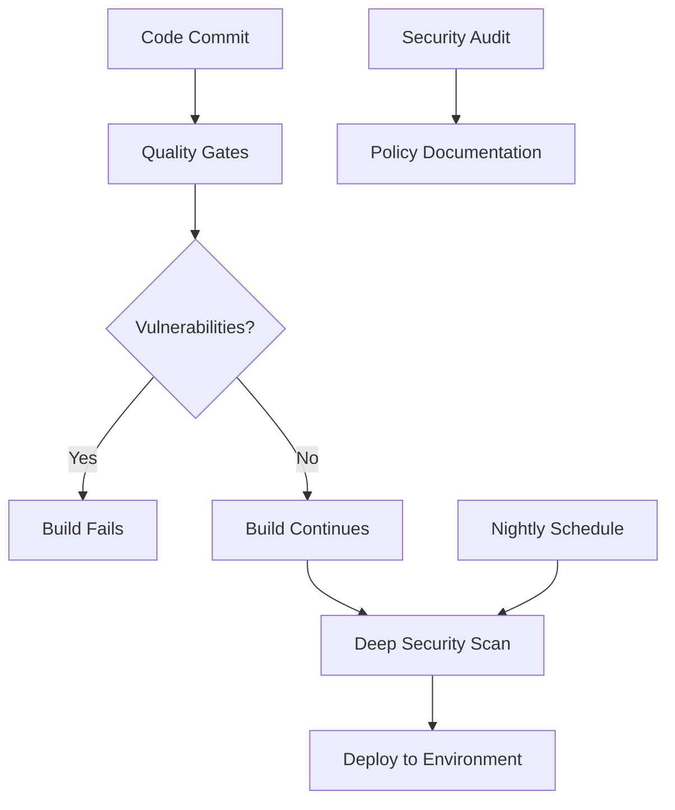

# Security Directory Structure

This document clarifies the organization of security-related tools and documentation in the observability platform.

## 📁 Directory Structure

```
├── ci/security/           # Automated Security Scanning Tools
│   ├── checkov/          # Infrastructure as Code (IaC) Security
│   └── trivy/            # Container Image Security
├── ci/quality-gates/     # Dependency Vulnerability Scanning
│   └── dependency-check.sh
└── security/             # Security Documentation & Policies
    ├── irsa-mappings.md
    ├── kms-policies.md
    └── network-controls.md
```

## 🔍 Tool Responsibilities

### `ci/security/` - **Deep Security Analysis**

#### 🏗️ **Checkov** (`ci/security/checkov/`)

- **Purpose**: Infrastructure as Code (IaC) security scanning
- **Scope**: Terraform, CloudFormation, Kubernetes YAML
- **Focus**: Misconfigurations, policy violations, best practices
- **Output**: Detailed compliance reports with remediation guidance
- **When to run**: Pre-deployment, policy validation

#### 🛡️ **Trivy** (`ci/security/trivy/`)

- **Purpose**: Container image vulnerability scanning
- **Scope**: Docker images, container registries
- **Focus**: CVE detection, OS packages, language libraries
- **Output**: Vulnerability reports with CVSS scores
- **When to run**: Image builds, registry scanning

### `ci/quality-gates/` - **Lightweight Dependency Scanning**

#### 🔍 **Dependency Check** (`ci/quality-gates/dependency-check.sh`)

- **Purpose**: Multi-stack dependency vulnerability scanning
- **Scope**: Python (pip), Node.js (npm), containers (grype), Terraform providers
- **Focus**: Known vulnerabilities in dependencies
- **Output**: Pass/fail quality gate for CI/CD
- **When to run**: Every CI build, pre-merge validation

### `security/` - **Security Documentation**

#### 📋 **Policy Documentation**

- **IRSA Mappings**: AWS IAM Roles for Service Accounts configuration
- **KMS Policies**: Key Management Service security policies
- **Network Controls**: Network security and isolation policies

## 🎯 Usage Guidelines

### **For CI/CD Pipeline:**

```bash
# Quality gate (fast, every build)
make quality-gates

# Deep security scan (slower, nightly/weekly)
make security-scan
```

### **For Development:**

```bash
# Quick dependency check
ci/quality-gates/dependency-check.sh

# Infrastructure security validation
ci/security/checkov/run-checkov.sh

# Container security validation
ci/security/trivy/scan-containers.sh
```

## 🔄 Integration Flow



## 📊 Tool Comparison

| Tool                 | Speed     | Coverage         | Detail Level | Use Case            |
| -------------------- | --------- | ---------------- | ------------ | ------------------- |
| **dependency-check** | Fast ⚡   | Dependencies     | Medium       | CI Quality Gate     |
| **checkov**          | Medium 🐌 | IaC Config       | High         | Security Validation |
| **trivy**            | Medium 🐌 | Container Images | High         | Image Security      |

## 🚨 Security Levels

### **Level 1: Quality Gates** (Required for all builds)

- Dependency vulnerability scanning
- Basic security checks
- Fast execution (< 2 minutes)

### **Level 2: Security Validation** (Pre-deployment)

- Infrastructure security scanning
- Container image analysis
- Comprehensive reporting (5-10 minutes)

### **Level 3: Security Audit** (Periodic)

- Full security posture assessment
- Policy compliance validation
- Detailed remediation planning

## 🛠️ Maintenance

- **Quality Gates**: Updated automatically with dependency updates
- **Security Tools**: Updated monthly or when new vulnerabilities emerge
- **Documentation**: Updated with infrastructure changes
