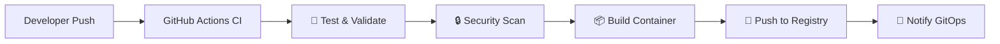
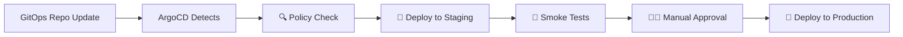

# 🚀 Real-World GitOps Architecture

## 📋 **Industry Standard Deployment Pattern**

### **Repository Structure**

```
├── 📦 observability-platform (THIS REPO)
│   ├── .github/workflows/ci.yaml     # CI: Build, Test, Publish
│   ├── .github/workflows/deploy.yaml # CD: Deploy to environments
│   ├── Dockerfile.ci                 # Container definition
│   └── src/                         # Application code
│
├── 📋 observability-gitops (SEPARATE REPO)
│   ├── environments/
│   │   ├── staging/
│   │   │   ├── kustomization.yaml
│   │   │   └── values.yaml
│   │   └── production/
│   │       ├── kustomization.yaml
│   │       └── values.yaml
│   ├── base/
│   │   ├── deployment.yaml
│   │   ├── service.yaml
│   │   └── kustomization.yaml
│   └── argocd/
│       ├── staging-app.yaml
│       └── production-app.yaml
```

## 🔄 **Complete GitOps Flow**

### **Phase 1: Continuous Integration (THIS REPO)**



### **Phase 2: GitOps Deployment (SEPARATE REPO)**



## 🏗️ **Implementation Steps**

### **Step 1: Create GitOps Repository**

```bash
# Create separate GitOps repository
gh repo create observability-gitops --private
git clone https://github.com/NaserRaoofi/observability-gitops.git
cd observability-gitops
```

### **Step 2: Setup ArgoCD Applications**

```yaml
# argocd/production-app.yaml
apiVersion: argoproj.io/v1alpha1
kind: Application
metadata:
  name: observability-production
  namespace: argocd
spec:
  project: default
  source:
    repoURL: https://github.com/NaserRaoofi/observability-gitops
    targetRevision: HEAD
    path: environments/production
  destination:
    server: https://kubernetes.default.svc
    namespace: observability
  syncPolicy:
    automated:
      prune: true
      selfHeal: true
    syncOptions:
      - CreateNamespace=true
```

### **Step 3: Environment Manifests**

```yaml
# environments/production/kustomization.yaml
apiVersion: kustomize.config.k8s.io/v1beta1
kind: Kustomization

resources:
  - ../../base

images:
  - name: observability-app
    newName: ghcr.io/naserraoofi/observability-platform
    newTag: latest

patchesStrategicMerge:
  - values.yaml
```

```yaml
# environments/production/values.yaml
apiVersion: apps/v1
kind: Deployment
metadata:
  name: observability-app
spec:
  replicas: 3
  template:
    spec:
      containers:
        - name: app
          resources:
            requests:
              memory: "256Mi"
              cpu: "100m"
            limits:
              memory: "512Mi"
              cpu: "500m"
          env:
            - name: ENVIRONMENT
              value: "production"
```

## 🔧 **GitHub Secrets Setup**

### **Required Secrets:**

```bash
# In observability-platform repo
GITOPS_PAT=<personal_access_token_for_gitops_repo>

# In observability-gitops repo
KUBE_CONFIG=<base64_encoded_kubeconfig>
STAGING_CLUSTER_URL=<staging_cluster_endpoint>
PROD_CLUSTER_URL=<production_cluster_endpoint>
```

## 🎯 **Benefits of This Architecture**

### **✅ Security Benefits**

- **Separation of Concerns** - Code repo vs deployment repo
- **Access Control** - Different permissions for different repos
- **Audit Trail** - Complete deployment history in git
- **Rollback Capability** - Git-based rollbacks

### **✅ Operational Benefits**

- **Environment Promotion** - Clear path from staging to prod
- **Configuration Management** - Environment-specific configs
- **Disaster Recovery** - Complete infrastructure as code
- **Compliance** - Auditable deployment process

### **✅ Developer Experience**

- **Push to Deploy** - Developers just push code
- **Environment Parity** - Same process for all environments
- **Visibility** - Clear deployment status in ArgoCD
- **Self-Service** - Teams can manage their own deployments

## 🚦 **Environment Promotion Strategy**

### **Staging Environment**

- **Automatic Deployment** - Every main branch push
- **Integration Testing** - Full test suite execution
- **Performance Testing** - Load testing and monitoring
- **Security Validation** - Runtime security scanning

### **Production Environment**

- **Manual Approval** - Required for production deployment
- **Blue/Green Deployment** - Zero-downtime deployments
- **Monitoring Integration** - Automatic rollback on errors
- **Business Hours Only** - Deployment windows

## 📊 **Monitoring & Observability**

### **ArgoCD Dashboard**

- Real-time deployment status
- Application health monitoring
- Sync status and drift detection
- Rollback capabilities

### **Prometheus Metrics**

- Deployment frequency
- Lead time for changes
- Mean time to recovery
- Change failure rate

This is the **industry-standard approach** used by companies like Netflix, Spotify, and Google! 🎯
