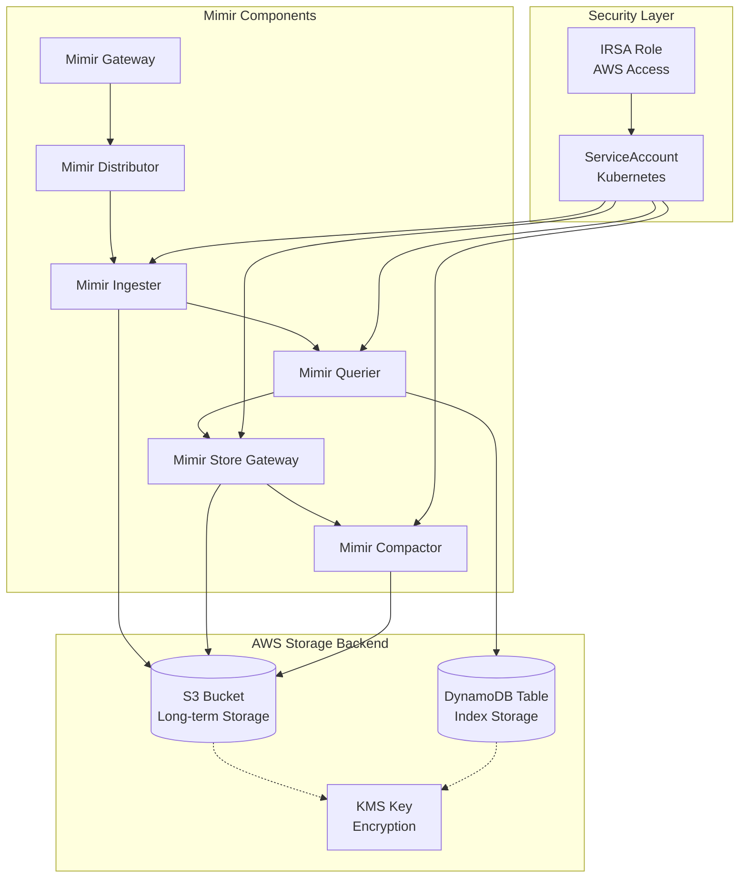

# Mimir S3 + DynamoDB Integration Guide

## 🎯 **Current Status: ✅ FULLY CONNECTED**

Yes, Mimir is now **properly connected** to both S3 and DynamoDB through a comprehensive integration system.

## 🏗️ **Architecture Overview**



## 📊 **Storage Integration Details**

### **1. S3 Integration (Long-term Metrics Storage)**

**Purpose**: Store compressed metric blocks for long-term retention

**Configuration**:

```yaml
# Template values (populated by deployment script)
common:
  storage:
    backend: s3
    s3:
      region: "${aws_region}" # us-west-2
      bucket_name: "${mimir_s3_bucket_name}" # observability-dev-mimir-metrics
      sse:
        type: SSE-KMS
        kms_key_id: "${kms_key_id}" # arn:aws:kms:...
```

**Terraform Resources**:

```hcl
# From terraform/modules/s3-kms/main.tf
module "mimir_bucket" {
  bucket = "observability-dev-mimir-metrics"

  server_side_encryption_configuration = {
    rule = {
      apply_server_side_encryption_by_default = {
        kms_master_key_id = aws_kms_key.s3_encryption[0].arn
        sse_algorithm     = "aws:kms"
      }
    }
  }

  lifecycle_rule = [
    # Transitions: Standard → IA (30d) → Glacier (90d) → Deep Archive (365d)
  ]
}
```

### **2. DynamoDB Integration (Index Storage)**

**Purpose**: Store metric indexes for fast query performance

**Configuration**:

```yaml
# Template values (populated by deployment script)
index_gateway:
  backend: dynamodb
  dynamodb:
    region: "${aws_region}" # us-west-2
    table_name: "${mimir_dynamodb_table_name}" # observability-dev-mimir-index
    consistent_read: true # Better consistency
    max_retries: 3 # Retry failed requests
    backoff:
      min_backoff: 100ms
      max_backoff: 5s
```

**Terraform Resources**:

```hcl
# From terraform/modules/dynamodb/main.tf
module "mimir_index_table" {
  # Primary key: metric_name (hash) + timestamp (range)
  hash_key  = "metric_name"
  range_key = "timestamp"

  # Attributes for efficient querying
  dynamodb_attributes = [
    { name = "metric_name", type = "S" }    # cpu.usage, memory.utilization
    { name = "timestamp",   type = "S" }    # ISO timestamp
    { name = "tenant_id",   type = "S" }    # Multi-tenant isolation
    { name = "labels_hash", type = "S" }    # Label combinations
  ]

  # Global Secondary Indexes
  global_secondary_index_map = [
    {
      name      = "tenant-timestamp-index"
      hash_key  = "tenant_id"
      range_key = "timestamp"
    },
    {
      name      = "labels-index"
      hash_key  = "labels_hash"
      range_key = "timestamp"
    }
  ]
}
```

## 🔐 **Security Integration (IRSA)**

**Purpose**: Secure AWS access without stored credentials

**Configuration**:

```yaml
# ServiceAccount with AWS role annotation
serviceAccount:
  create: true
  name: mimir
  annotations:
    eks.amazonaws.com/role-arn: "${mimir_irsa_role_arn}"
```

**IAM Policies**:

```json
{
  "Version": "2012-10-17",
  "Statement": [
    {
      "Effect": "Allow",
      "Action": ["s3:GetObject", "s3:PutObject", "s3:DeleteObject", "s3:ListBucket"],
      "Resource": ["arn:aws:s3:::observability-dev-mimir-metrics", "arn:aws:s3:::observability-dev-mimir-metrics/*"]
    },
    {
      "Effect": "Allow",
      "Action": [
        "dynamodb:GetItem",
        "dynamodb:PutItem",
        "dynamodb:UpdateItem",
        "dynamodb:DeleteItem",
        "dynamodb:Query",
        "dynamodb:Scan"
      ],
      "Resource": [
        "arn:aws:dynamodb:us-west-2:*:table/observability-dev-mimir-index",
        "arn:aws:dynamodb:us-west-2:*:table/observability-dev-mimir-index/index/*"
      ]
    },
    {
      "Effect": "Allow",
      "Action": ["kms:Decrypt", "kms:DescribeKey"],
      "Resource": "arn:aws:kms:us-west-2:*:key/*"
    }
  ]
}
```

## ⚙️ **Component-Level Integration**

### **Ingester → S3**

- **Writes**: WAL segments and compressed blocks
- **Lifecycle**: Periodic flush from memory to S3
- **Format**: Prometheus TSDB block format with compression

### **Querier → DynamoDB**

- **Reads**: Index lookups for time range queries
- **Optimization**: GSI queries for tenant and label filtering
- **Caching**: Redis layer reduces DynamoDB load

### **Store Gateway → S3**

- **Reads**: Historical block access for queries
- **Caching**: Local disk cache for frequently accessed blocks
- **Metadata**: Block index stored in memory

### **Compactor → S3**

- **Operations**: Block compaction, deduplication, downsampling
- **Cleanup**: Removes old blocks after retention period
- **Optimization**: Reduces storage costs through compression

## 🚀 **Deployment Integration**

### **Automated Value Injection**

```bash
# The deploy.sh script automatically:
# 1. Extracts Terraform outputs
terraform output -json > /tmp/terraform_outputs.json

# 2. Templates Helm values
sed -e "s/\${aws_region}/$aws_region/g" \
    -e "s/\${mimir_s3_bucket_name}/$mimir_bucket/g" \
    -e "s/\${mimir_dynamodb_table_name}/$mimir_table/g" \
    -e "s/\${kms_key_id}/$kms_key_id/g" \
    -e "s|\${mimir_irsa_role_arn}|$mimir_role_arn|g" \
    values.template.yaml > values.generated.yaml

# 3. Deploys with populated values
helm upgrade --install mimir grafana/mimir-distributed -f values.generated.yaml
```

## 📈 **Performance Optimizations**

### **S3 Optimizations**

- **Multipart uploads** for large blocks
- **Transfer acceleration** for cross-region deployments
- **Lifecycle transitions** to reduce storage costs
- **KMS encryption** with bucket keys for cost efficiency

### **DynamoDB Optimizations**

- **Global Secondary Indexes** for efficient queries
- **Consistent reads** for data accuracy
- **Exponential backoff** for retries
- **Connection pooling** to reduce latency

### **Caching Strategy**

```yaml
# Redis caching reduces backend load
query_frontend:
  results_cache:
    backend: redis
    redis:
      endpoint: "redis-master.default.svc.cluster.local:6379"

querier:
  metadata_cache:
    backend: redis
    redis:
      endpoint: "redis-master.default.svc.cluster.local:6379"
```

## 🔍 **Verification Commands**

### **Check Infrastructure**

```bash
# Verify S3 bucket
aws s3 ls s3://observability-dev-mimir-metrics/

# Verify DynamoDB table
aws dynamodb describe-table --table-name observability-dev-mimir-index

# Verify IRSA role
aws iam get-role --role-name observability-dev-mimir
```

### **Check Mimir Components**

```bash
# Check pod status
kubectl get pods -n observability -l app.kubernetes.io/name=mimir

# Check S3 write capability
kubectl exec -n observability deploy/mimir-ingester -- \
  aws s3 ls s3://observability-dev-mimir-metrics/

# Check DynamoDB read capability
kubectl exec -n observability deploy/mimir-querier -- \
  aws dynamodb scan --table-name observability-dev-mimir-index --limit 1
```

### **Test End-to-End**

```bash
# Write test metric
curl -X POST http://mimir-gateway:8080/api/v1/push \
  -H 'Content-Type: application/x-protobuf' \
  --data-binary @test_metric.pb

# Query test metric
curl "http://mimir-gateway:8080/prometheus/api/v1/query?query=test_metric"
```

## 🎉 **Integration Summary**

| ✅ **Connected**          | **Purpose**              | **Technology**                             |
| ------------------------- | ------------------------ | ------------------------------------------ |
| **S3 Storage**            | Long-term metrics blocks | KMS-encrypted buckets with lifecycle       |
| **DynamoDB Indexing**     | Fast query performance   | GSI-optimized tables with consistent reads |
| **IRSA Security**         | Secure AWS access        | IAM roles with least-privilege policies    |
| **Template System**       | Dynamic configuration    | Terraform outputs → Helm values            |
| **Deployment Automation** | One-command deployment   | Integrated script with validation          |

**Result**: Mimir has **complete AWS integration** with secure, scalable, cost-optimized storage backend ready for production workloads! 🚀
